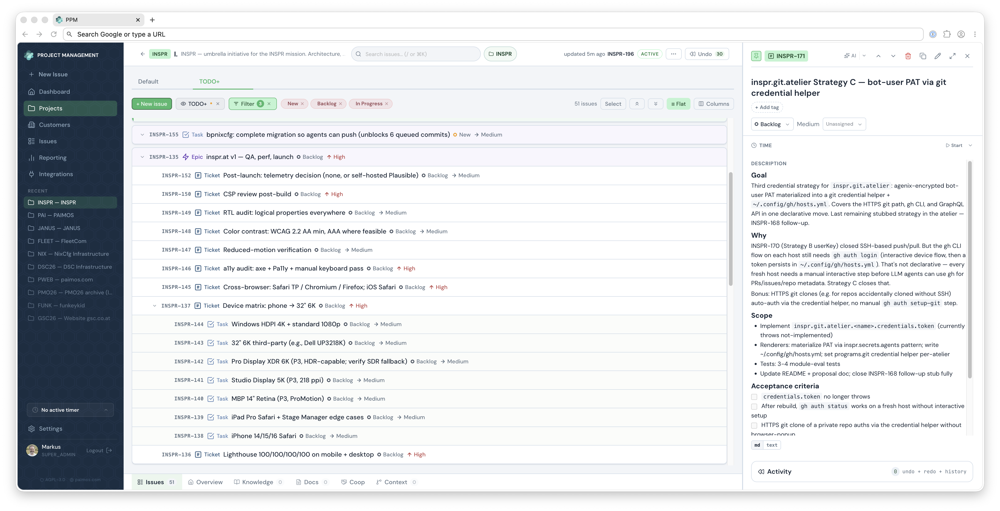

<p align="center">
  
</p>

<h1 align="center">Paimos</h1>

<p align="center">
  <strong>One project picture for people and AI agents.</strong>
</p>

<p align="center">
  Paimos keeps project work, repository context, operating knowledge,
  execution choices, and run evidence in one self-hosted system.
</p>

<p align="center">
  <code>v5.0.0</code> · <code>AGPL-3.0-only</code> ·
  <code>Go + Vue + SQLite</code>
</p>

<p align="center">
  <a href="https://paimos.inspr.at">Product site</a> ·
  <a href="#quick-start">Quick start</a> ·
  <a href="docs/AGENT_INTERFACE.md">Agent interface</a> ·
  <a href="docs/CONFIGURATION.md">Configuration</a> ·
  <a href="docs/HARDENING.md">Operations</a> ·
  <a href="SECURITY.md">Security</a> ·
  <a href="CONTRIBUTING.md">Contributing</a> ·
  <a href="LICENSE">License</a>
</p>

---

<p align="center">
  
</p>

Paimos is a self-hosted project management and execution-context system for
software teams working with AI agents. People use the web application. Agents
use the CLI, MCP facade, or JSON API. Both work against the same project state,
permissions, knowledge, and history.

> [!NOTE]
> Paimos 4.8 is production-used and actively developed. Its current deployment
> model is deliberately compact: one Go process and one SQLite database. It is
> not a multi-node high-availability service. See
> [Current maturity and limits](#current-maturity-and-limits) before a production
> rollout.

## Why Paimos exists

An issue tracker tells an agent what a ticket says. It usually does not tell the
agent which repository matters, which operating rule applies, what earlier work
established, what it may execute, or what evidence must come back.

Paimos keeps those facts connected:

```text
project work
  + linked repositories
  + maintained knowledge
  + issue-to-file anchors
  + people and project agents
  + bounded execution choices
  + action and run evidence
  = one inspectable project history
```

This is useful without AI as a focused project system. With agents, the same
model becomes the context and accountability layer around their work.

## What ships in 4.8

| Area                | Current capability                                                                                                                                                                                           |
| ------------------- | ------------------------------------------------------------------------------------------------------------------------------------------------------------------------------------------------------------ |
| Project work        | Hierarchical issues, relations, sprints, releases, priorities, tags, saved views, bulk changes, time tracking, budgets, comments, attachments, and full-text search.                                         |
| Project context     | Linked repositories, typed knowledge, canonical project-agent artifacts, issue-to-file anchors, entity graph and blast-radius reads, and mixed-context retrieval.                                            |
| Agent interfaces    | A typed `paimos` CLI, `paimos-mcp`, REST, curated OpenAPI, self-describing schema, JSON output, file-first multiline input, dry runs, idempotent transitions, and declarative bulk apply.                    |
| Assisted work       | Thirteen in-app AI actions with operator-managed prompts, usage limits, cost records, execution profiles, context packs, and metadata-only audit records.                                                    |
| Implementation runs | Explicit Claude Code and Codex local-runner actions, plus OpenRouter and OpenAI-compatible local-model draft providers. Draft providers cannot claim repository mutation, tests, shell, or deploy authority. |
| Collaboration       | Internal roles and project grants, an external customer portal, acceptance workflows, customer-facing summaries, and JSON/PDF project reports.                                                               |
| Integrations        | Generic OIDC, Jira, Mite, CSV import/export, HubSpot, and an HMAC-signed HTTP CRM sidecar contract. Optional integrations do not become core runtime dependencies.                                           |
| Operations          | Docker deployment, tracked startup migrations, SQLite WAL, optional S3-compatible attachments and SMTP, health/schema endpoints, configurable branding, retention controls, and backup/restore runbooks.     |
| Supply chain        | Keylessly signed container images, CycloneDX backend and frontend SBOM attestations, checksums, and build provenance in the release workflow.                                                                |

The [claim and evidence matrix](docs/claim-matrix.md) connects public claims to
shipped code and documented verification.

### What changed in 4.8

- Generic OIDC login now covers authorization code with PKCE, verified-email
  matching, invite-only provisioning by default, and local Paimos authorization.
  Zitadel is the validated reference provider.
- AI actions and implementation runs share explicit provider, profile, effort,
  prompt, context-pack, project-agent, and runner metadata.
- Claude Code and Codex are distinct local execution choices. OpenRouter and
  OpenAI-compatible local endpoints remain draft-only model paths.
- Knowledge entries can provide scoped prompt context while preserving existing
  metadata unless a caller explicitly replaces it.

For release-by-release detail, read the [changelog](docs/CHANGELOG.md).

## Human and agent work share one model

### Web application

The Vue interface covers everyday planning and delivery work: issue hierarchy,
side-panel editing, search, filters, custom views, sprints, time, reports,
administration, and the customer portal. It is keyboard-oriented and backed by
the same JSON routes used by first-party automation.

### CLI, MCP, and API

The official CLI handles issue-key resolution, authentication, multiline
Markdown, JSON responses, safe status transitions, attachments, time tracking,
knowledge, sessions, and bulk workflows.

```bash
paimos issue get PAI-83
paimos issue list --project PAI --status backlog --limit 20
paimos search "session expiry" --project PAI
paimos issue ensure-status PAI-83 done
paimos apply --from-file plan.yaml --dry-run
```

Use the [Agent Interface Guide](docs/AGENT_INTERFACE.md) for the CLI and MCP
surface, [Agent Integration](docs/AGENT_INTEGRATION.md) for workflow contracts,
and [the REST reference](docs/api-minimal.md) when direct HTTP is appropriate.

Two discovery endpoints keep clients from hard-coding local assumptions:

- `GET /api/openapi.json` describes the stable public scriptable contract.
- `GET /api/schema` describes enums, transitions, conventions, scopes, and
  resource shapes.

### Execution stays local and explicit

Paimos records an implementation request on the server, but it does not open a
remote shell into a developer workstation.

```text
issue action
    -> server-side run record
    -> developer starts `paimos run-agent watch`
    -> repo-scoped local runner claims one job
    -> Claude Code or Codex edits and tests locally
    -> status and value-free provenance return to Paimos
```

The watcher is operator-started, repo-scoped, single-job, and interactive by
default. Deployment is disabled unless the operator enables the runner, supplies
an explicit deploy command, and the run names a deploy target. Hosted and local
model draft providers produce notes without entering this execution path.

See [Implement-this providers](docs/IMPLEMENT_THIS_PROVIDERS.md) and the
[threat model](docs/THREAT_MODEL.md#48--remote-triggered-execution-pai-605) for
the exact boundary.

## Architecture

```text
Browser / CLI / MCP / REST client
               |
               v
        Go service on :8888
        |       |        |
        |       |        +-- optional OIDC, SMTP, and model providers
        |       +----------- optional S3-compatible attachment storage
        +------------------- SQLite in WAL mode
                              ($DATA_DIR is the backup boundary)
```

- One Go process serves the JSON API and the compiled Vue application.
- SQLite is the system of record. Tracked forward migrations run at startup;
  schema rollback requires restoring the matching database backup with the old
  image.
- There is no required external database, Redis, queue, analytics service, or
  Paimos SaaS dependency.
- S3-compatible storage is needed only for attachments. SMTP is needed only for
  password-reset email. OIDC and model providers are operator choices.
- Absent optional services disable their feature. Provider initialization
  failures are reported without preventing the core project system from
  starting.
- Runtime fonts are bundled, and the application ships without analytics,
  externally hosted runtime scripts, or product telemetry.

The complete developer view lives in the
[Developer Guide](docs/DEVELOPER_GUIDE.md). Operator settings and set-once
values live in [Configuration](docs/CONFIGURATION.md).

## Quick start

The following starts a local evaluation instance from source:

```bash
git clone https://github.com/inspr-at/paimos.git
cd paimos

docker build -t paimos:local .
docker run --rm \
  --name paimos \
  -p 8888:8888 \
  -e ADMIN_PASSWORD='replace-this-local-password' \
  -v paimos-data:/app/data \
  paimos:local
```

Open <http://localhost:8888> and sign in as `admin` with the password supplied
above. A fresh database seeds the admin only when `ADMIN_PASSWORD` is present.
Change that password immediately. The variable has no effect after the admin
exists and should not remain in a production environment.

> [!IMPORTANT]
> This command is for local evaluation. Before exposing Paimos to a network,
> put it behind HTTPS, enable secure cookies, move secrets out of shell history,
> protect and back up `$DATA_DIR`, configure off-host backups, and review the
> [Hardening Guide](docs/HARDENING.md).

### Install the CLI

Signed and notarized universal macOS builds, Linux archives, checksums, and
source-build instructions are documented in [Installing the Paimos CLI](docs/INSTALL.md).

```bash
curl -fL https://github.com/inspr-at/paimos/releases/latest/download/paimos_darwin_universal.tar.gz \
  | tar xz -C /usr/local/bin paimos

paimos auth login
paimos doctor
```

Authentication details are stored in a mode-`0600` configuration file; API keys
use the operating-system keyring when available. Headless environments can use
explicit environment configuration as documented in the install guide.

## Local development

Requirements:

- Go 1.25+
- Node.js 22+
- npm

Run the backend and frontend in separate terminals:

```bash
# terminal 1
cd backend
ADMIN_PASSWORD='local-development-only' \
  DATA_DIR=../data \
  STATIC_DIR=../frontend/dist \
  go run .

# terminal 2
cd frontend
npm ci
npm run dev
```

The API listens on <http://localhost:8888>. Vite listens on
<http://localhost:5173> and proxies `/api/*` to the backend.

For authenticated UI development, use the build-tagged workflow in
[Local development login](docs/DEV_LOGIN.md). That route is absent from
production binaries and checked by CI.

### Validation commands

```bash
cd backend && go test ./...
cd frontend && npm test -- --run
cd frontend && npm run typecheck && npm run build
```

## Trust and security

Paimos documents its trust boundary instead of treating self-hosting as a
security guarantee.

| Boundary         | Current behavior                                                                                                                                               |
| ---------------- | -------------------------------------------------------------------------------------------------------------------------------------------------------------- |
| Authentication   | Local password, TOTP, API keys, and one generic OIDC provider. OIDC uses authorization code with PKCE and requires a verified email.                           |
| Authorization    | Canonical roles, project-level view/edit grants, scoped API keys, and explicit super-admin capabilities. Permission changes invalidate affected live sessions. |
| Browser sessions | `HttpOnly`, `SameSite=Lax`, secure-cookie support, CSRF tokens, bounded sliding sessions, and shared rate limits on authentication endpoints.                  |
| Files            | Active browser content is rejected on upload; stored content is re-sniffed and unsafe types are forced to download.                                            |
| Audit            | Session-mutation audit is on by default. AI audit records contain metadata, not prompts, responses, API keys, or local environment values.                     |
| Data rights      | Configurable retention plus administrative per-subject export and erase primitives. Historical project evidence is anonymized rather than silently deleted.    |
| Secrets          | Operator-entered provider secrets use authenticated encryption at rest. Production operators should supply the master key separately from `$DATA_DIR`.         |
| Releases         | CI runs tests and security scanners, publishes checksums and CycloneDX SBOMs, signs images with GitHub OIDC, and attaches provenance attestations.             |

Read the maintained [Threat Model](docs/THREAT_MODEL.md),
[Hardening Guide](docs/HARDENING.md), [Security Review](docs/SECURITY_REVIEW.md),
and [Backup/Restore Guide](docs/BACKUP_RESTORE.md) before production use.

Report vulnerabilities privately to `security@paimos.com`. The supported-version
policy and disclosure process are in [SECURITY.md](SECURITY.md).

## Current maturity and limits

The boundaries below are part of the product description, not fine print:

- Paimos is a compact single-node Go and SQLite system. It does not provide
  multi-node high availability or automatic horizontal scaling.
- No published performance envelope exists yet. Test representative issue,
  attachment, user, and concurrency volumes before a production rollout.
- Security fixes are provided for the latest release only.
- The project has not completed an independent third-party security review.
- The evidence base currently includes one active maintainer-operated production
  deployment and one historical independent second-operator deployment. This is
  meaningful operational use, not broad market validation.
- One generic OIDC provider is supported. SAML is not. The current flow relies on
  the provider's TLS-protected userinfo response rather than locally validating
  the ID token through JWKS.
- Audit history is held locally. A host administrator with direct SQLite write
  access can alter it; remote append-only audit requires an external sink.
- Paimos does not encrypt the entire SQLite database. Operators remain
  responsible for encrypted storage, transport security, secret injection,
  backups, and restore exercises.
- The published container currently has no non-root `USER` declaration. Run it
  with an explicit runtime user and correctly owned storage when your deployment
  requires that boundary.
- Local AI runners can edit a repository only after a developer starts and
  authorizes the repo-scoped watcher. Paimos is not a general remote shell or an
  autonomous deployment service.

Production evidence and open gaps are maintained in
[Reference Deployments](docs/REFERENCE_DEPLOYMENTS.md), the
[Threat Model](docs/THREAT_MODEL.md), and the
[Claim/Evidence Matrix](docs/claim-matrix.md).

## Documentation map

| Need                        | Start here                                                                                                                                               |
| --------------------------- | -------------------------------------------------------------------------------------------------------------------------------------------------------- |
| Operate the web application | [Configuration](docs/CONFIGURATION.md), [Hardening](docs/HARDENING.md), [Deploy/Rollback](docs/DEPLOY.md), [Backup/Restore](docs/BACKUP_RESTORE.md)      |
| Drive Paimos from an agent  | [Agent Interface](docs/AGENT_INTERFACE.md), [Agent Integration](docs/AGENT_INTEGRATION.md), [Implement-this Providers](docs/IMPLEMENT_THIS_PROVIDERS.md) |
| Integrate over HTTP         | [Minimal REST reference](docs/api-minimal.md), `GET /api/openapi.json`, `GET /api/schema`                                                                |
| Understand project context  | [Anchors](docs/ANCHORS.md), [Agent Integration](docs/AGENT_INTEGRATION.md#1a-reading-project-context-for-coding-agents)                                  |
| Review security posture     | [Security Policy](SECURITY.md), [Threat Model](docs/THREAT_MODEL.md), [Security Review](docs/SECURITY_REVIEW.md)                                         |
| Contribute code             | [Contributing](CONTRIBUTING.md), [Developer Guide](docs/DEVELOPER_GUIDE.md), [Agent Rules](+agents/rules/AGENTS.md)                                      |
| Follow releases             | [Changelog](docs/CHANGELOG.md), [Install Guide](docs/INSTALL.md)                                                                                         |

## Contributing

Issues and focused pull requests are welcome. Discuss new surface area before
building it, add regression coverage for bug fixes, and keep public API changes
aligned with `backend/handlers/openapi.json`.

Paimos uses the [Developer Certificate of Origin](DCO.md). Every commit must carry
a sign-off created with `git commit -s`. Read [CONTRIBUTING.md](CONTRIBUTING.md)
for the complete workflow.

## License

Paimos is licensed under
[GNU Affero General Public License v3.0 only](LICENSE), SPDX identifier
`AGPL-3.0-only`.

If you modify Paimos and let users interact with that modified version over a
network, AGPL section 13 requires offering those users the Corresponding Source
of the running modified version. Read the project license and the
[official GNU AGPL text](https://www.gnu.org/licenses/agpl-3.0.html) for the
complete terms.
